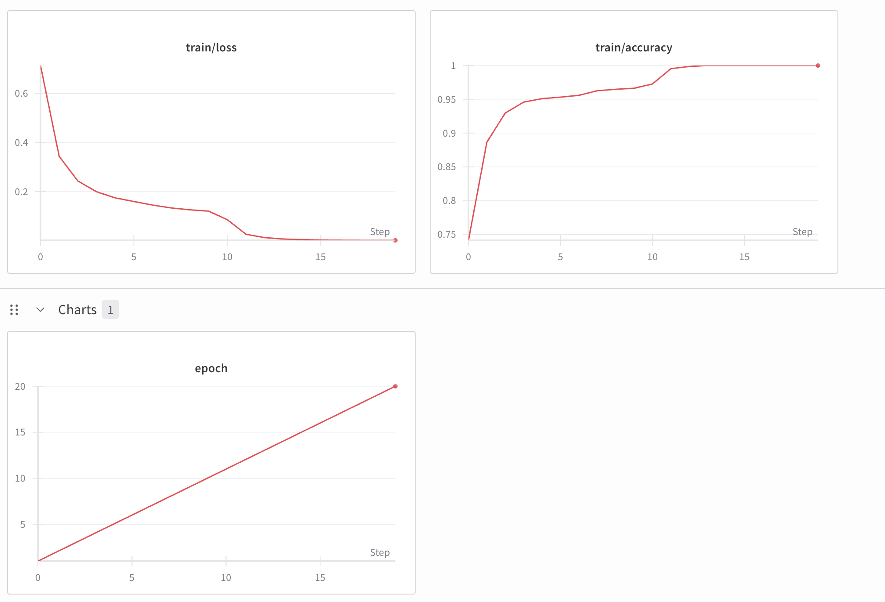
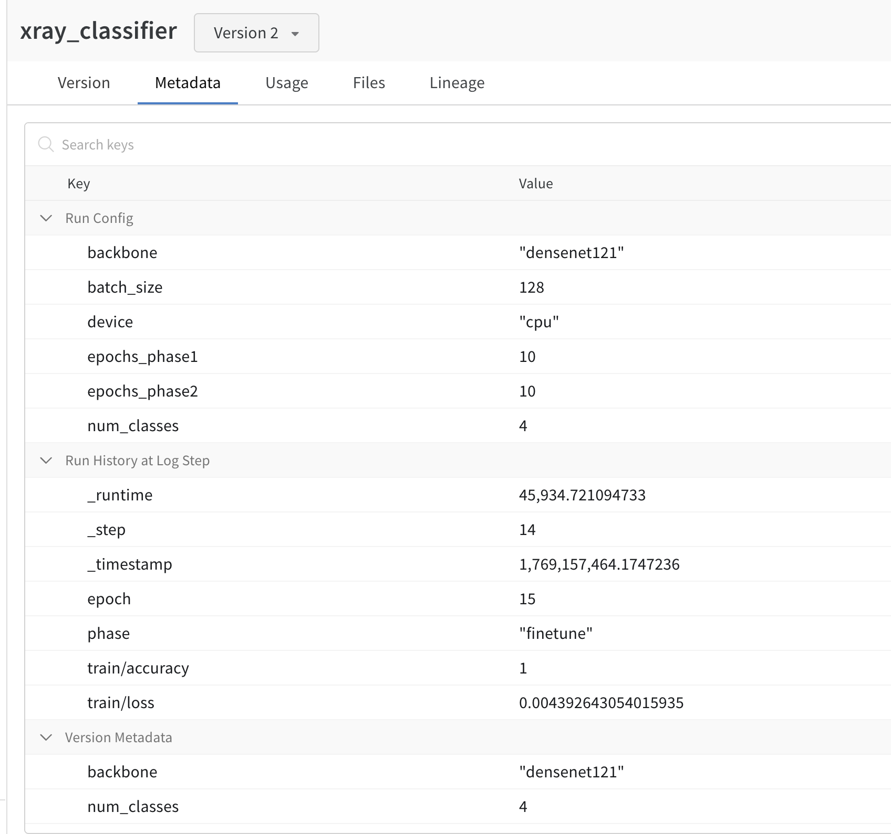
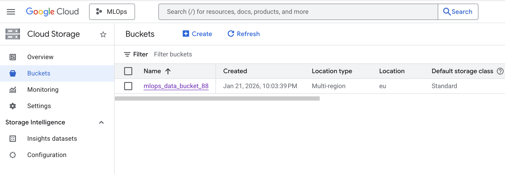
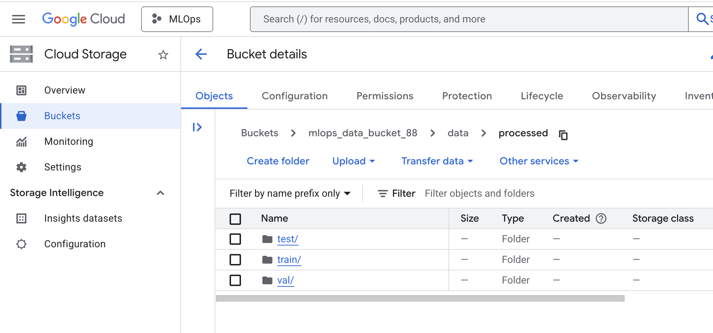
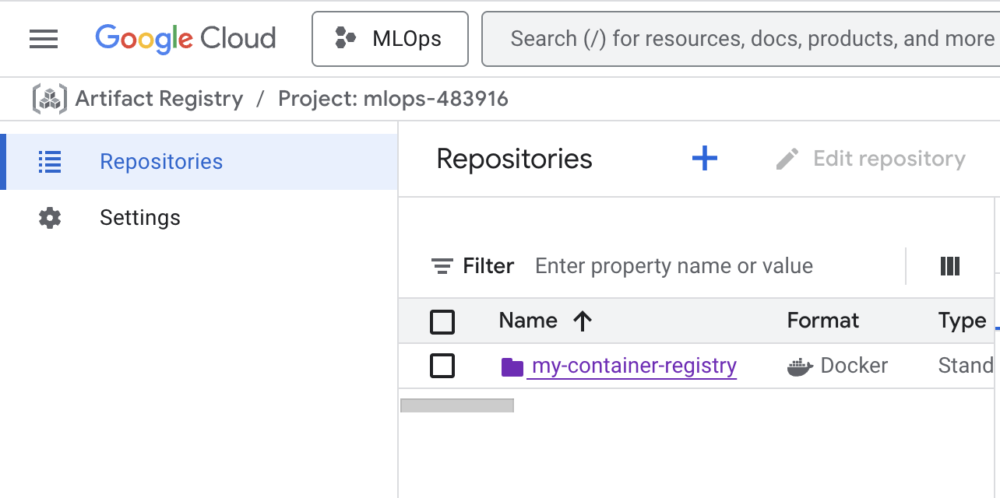
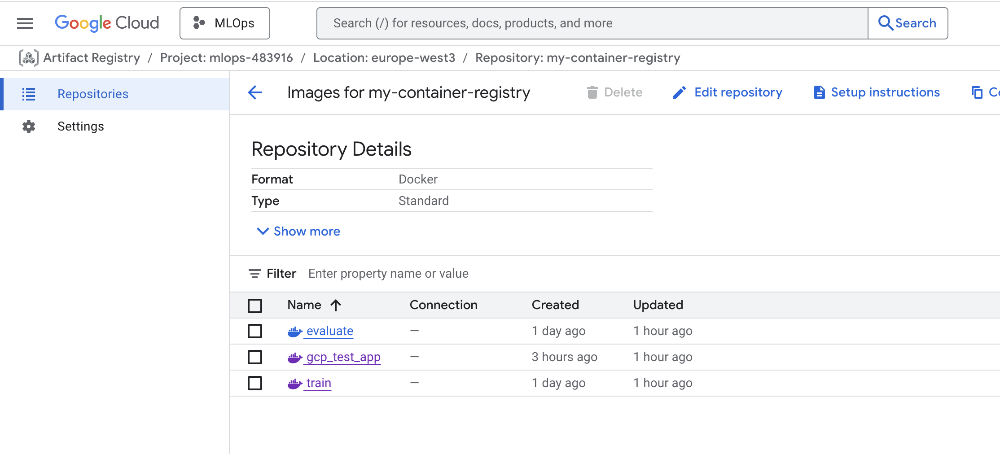
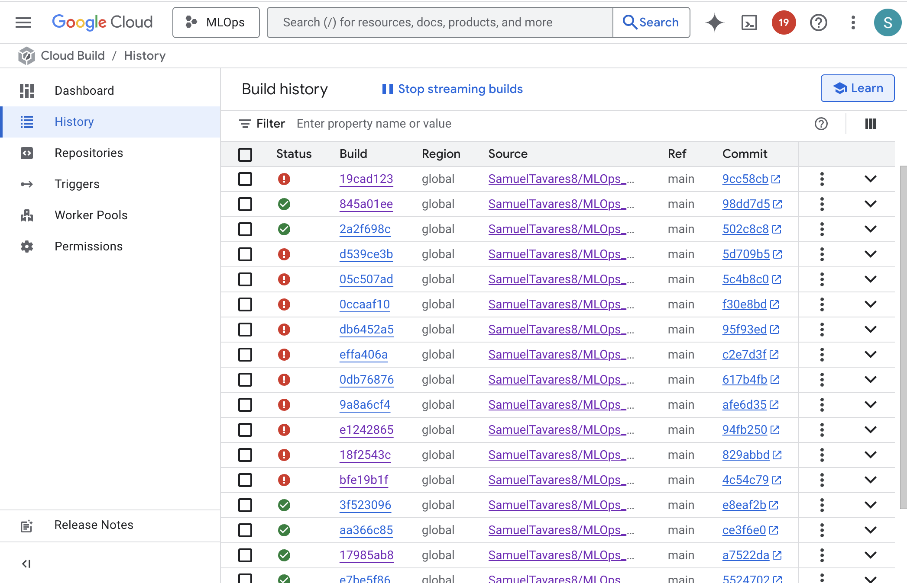

# Exam template for 02476 Machine Learning Operations

This is the report template for the exam. Please only remove the text formatted as with three dashes in front and behind
like:

```--- question 1 fill here ---```

Where you instead should add your answers. Any other changes may have unwanted consequences when your report is
auto-generated at the end of the course. For questions where you are asked to include images, start by adding the image
to the `figures` subfolder (please only use `.png`, `.jpg` or `.jpeg`) and then add the following code in your answer:

``

In addition to this markdown file, we also provide the `report.py` script that provides two utility functions:

Running:

```bash
python report.py html
```

Will generate a `.html` page of your report. After the deadline for answering this template, we will auto-scrape
everything in this `reports` folder and then use this utility to generate a `.html` page that will be your serve
as your final hand-in.

Running

```bash
python report.py check
```

Will check your answers in this template against the constraints listed for each question e.g. is your answer too
short, too long, or have you included an image when asked. For both functions to work you mustn't rename anything.
The script has two dependencies that can be installed with

```bash
pip install typer markdown
```

or

```bash
uv add typer markdown
```

## Overall project checklist

The checklist is *exhaustive* which means that it includes everything that you could do on the project included in the
curriculum in this course. Therefore, we do not expect at all that you have checked all boxes at the end of the project.
The parenthesis at the end indicates what module the bullet point is related to. Please be honest in your answers, we
will check the repositories and the code to verify your answers.

### Week 1

* [ ] Create a git repository (M5)
* [ ] Make sure that all team members have write access to the GitHub repository (M5)
* [ ] Create a dedicated environment for you project to keep track of your packages (M2)
* [ ] Create the initial file structure using cookiecutter with an appropriate template (M6)
* [ ] Fill out the `data.py` file such that it downloads whatever data you need and preprocesses it (if necessary) (M6)
* [ ] Add a model to `model.py` and a training procedure to `train.py` and get that running (M6)
* [ ] Remember to either fill out the `requirements.txt`/`requirements_dev.txt` files or keeping your
    `pyproject.toml`/`uv.lock` up-to-date with whatever dependencies that you are using (M2+M6)
* [ ] Remember to comply with good coding practices (`pep8`) while doing the project (M7)
* [ ] Do a bit of code typing and remember to document essential parts of your code (M7)
* [ ] Setup version control for your data or part of your data (M8)
* [ ] Add command line interfaces and project commands to your code where it makes sense (M9)
* [ ] Construct one or multiple docker files for your code (M10)
* [ ] Build the docker files locally and make sure they work as intended (M10)
* [ ] Write one or multiple configurations files for your experiments (M11)
* [ ] Used Hydra to load the configurations and manage your hyperparameters (M11)
* [ ] Use profiling to optimize your code (M12)
* [ ] Use logging to log important events in your code (M14)
* [ ] Use Weights & Biases to log training progress and other important metrics/artifacts in your code (M14)
* [ ] Consider running a hyperparameter optimization sweep (M14)
* [ ] Use PyTorch-lightning (if applicable) to reduce the amount of boilerplate in your code (M15)

### Week 2

* [ ] Write unit tests related to the data part of your code (M16)
* [ ] Write unit tests related to model construction and or model training (M16)
* [ ] Calculate the code coverage (M16)
* [ ] Get some continuous integration running on the GitHub repository (M17)
* [ ] Add caching and multi-os/python/pytorch testing to your continuous integration (M17)
* [ ] Add a linting step to your continuous integration (M17)
* [ ] Add pre-commit hooks to your version control setup (M18)
* [ ] Add a continues workflow that triggers when data changes (M19)
* [ ] Add a continues workflow that triggers when changes to the model registry is made (M19)
* [ ] Create a data storage in GCP Bucket for your data and link this with your data version control setup (M21)
* [ ] Create a trigger workflow for automatically building your docker images (M21)
* [ ] Get your model training in GCP using either the Engine or Vertex AI (M21)
* [ ] Create a FastAPI application that can do inference using your model (M22)
* [ ] Deploy your model in GCP using either Functions or Run as the backend (M23)
* [ ] Write API tests for your application and setup continues integration for these (M24)
* [ ] Load test your application (M24)
* [ ] Create a more specialized ML-deployment API using either ONNX or BentoML, or both (M25)
* [ ] Create a frontend for your API (M26)

### Week 3

* [ ] Check how robust your model is towards data drifting (M27)
* [ ] Setup collection of input-output data from your deployed application (M27)
* [ ] Deploy to the cloud a drift detection API (M27)
* [ ] Instrument your API with a couple of system metrics (M28)
* [ ] Setup cloud monitoring of your instrumented application (M28)
* [ ] Create one or more alert systems in GCP to alert you if your app is not behaving correctly (M28)
* [ ] If applicable, optimize the performance of your data loading using distributed data loading (M29)
* [ ] If applicable, optimize the performance of your training pipeline by using distributed training (M30)
* [ ] Play around with quantization, compilation and pruning for you trained models to increase inference speed (M31)

### Extra

* [ ] Write some documentation for your application (M32)
* [ ] Publish the documentation to GitHub Pages (M32)
* [ ] Revisit your initial project description. Did the project turn out as you wanted?
* [ ] Create an architectural diagram over your MLOps pipeline
* [ ] Make sure all group members have an understanding about all parts of the project
* [ ] Uploaded all your code to GitHub

## Group information

### Question 1
> **Enter the group number you signed up on <learn.inside.dtu.dk>**
>
> Answer:

88

### Question 2
> **Enter the study number for each member in the group**
>
> Example:
>
> *sXXXXXX, sXXXXXX, sXXXXXX*
>
> Answer:

*s251920, s251921*

### Question 3
> **Did you end up using any open-source frameworks/packages not covered in the course during your project? If so**
> **which did you use and how did they help you complete the project?**
>
> Recommended answer length: 0-200 words.
>
> Example:
> *We used the third-party framework ... in our project. We used functionality ... and functionality ... from the*
> *package to do ... and ... in our project*.
>
> Answer:

Yes. For the project, besides the tools covered in the course, we used the MONAI (Medical Open Network for AI) open-source framework to support our chest X-ray image classification task. MONAI is built on top of PyTorch and is specifically designed for medical imaging workflows. By importing models such as DenseNet and EfficientNet, we achieved very good classification accuracy and were able to focus more on the operations around our machine learning project rather than on implementing a model from scratch.

## Coding environment

> In the following section we are interested in learning more about you local development environment. This includes
> how you managed dependencies, the structure of your code and how you managed code quality.

### Question 4

> **Explain how you managed dependencies in your project? Explain the process a new team member would have to go**
> **through to get an exact copy of your environment.**
>
> Recommended answer length: 100-200 words
>
> Example:
> *We used ... for managing our dependencies. The list of dependencies was auto-generated using ... . To get a*
> *complete copy of our development environment, one would have to run the following commands*
>
> Answer:

We managed project dependencies using uv, which provides a good Python dependency management based on a lockfile. All required packages and their exact versions are defined in pyproject.toml automatically. Whenever dependencies were added or updated, the lockfile was regenerated, guaranteeing consistent environments for all team members.

So, to work in our project, a new team member would clone our Git repository, install uv, and run uv sync, which creates a virtual environment and installs all dependencies exactly as specified in the lockfile. This process avoids version mismatches and “works on my machine” issues.

For deployment and CI we also provided Docker images that encapsulate the runtime environment ensuring consistency between local development, testing, and execution. Git was used to version control both code and configuration files, enabling transparent collaboration and traceability of dependency changes throughout the project.

In addition, we used pre-commit hooks to enforce code quality locally before changes are committed. These hooks automatically run checks such as formatting and linting, helping catch issues early and keep the codebase consistent across the team. We also set up GitHub Actions to run automated tests and checks on every push and pull request, enabling the continuous integration of our project.

### Question 5

> **We expect that you initialized your project using the cookiecutter template. Explain the overall structure of your**
> **code. What did you fill out? Did you deviate from the template in some way?**
>
> Recommended answer length: 100-200 words
>
> Example:
> *From the cookiecutter template we have filled out the ... , ... and ... folder. We have removed the ... folder*
> *because we did not use any ... in our project. We have added an ... folder that contains ... for running our*
> *experiments.*
>
> Answer:

We initialized the project using the cookiecutter template provided in the course, which gave us a clean and well-structured starting point. We overall followed the template, adapting it to fit the needs of our medical imaging classification task.

The project root contains configuration and metadata files such as pyproject.toml, CI configuration, and Dockerfiles. The data folder is managed with DVC and stores both raw and processed datasets as .dvc files. These are further organized into raw and processed directories, each split into train, val, and test subsets, with subfolders corresponding to each classification target. This structure ensures clear data versioning and reproducibility.

The src folder contains the main source code, including dataset handling, model implementation, training and evaluation. We added an additional training file to run hydra experiments. Thus, our project has an usual training file, where profiling can be done optionally, and a train_hydra file that is prepared to run the

The tests folder contains unit and integration tests that are automatically executed in CI (data, model, training tests). It also has API and load tests.

 We also included a config folder to manage experiment and training configurations and a output one to record the hydra experiments of different model hyperparameters. Compared to the original template, we removed the notebooks folder and the LICENSE file, as notebooks were not used and licensing was not finalized at this stage. We also removed the file visualize.py in the source, since we did not use it in our project.

### Question 6

> **Did you implement any rules for code quality and format? What about typing and documentation? Additionally,**
> **explain with your own words why these concepts matters in larger projects.**
>
> Recommended answer length: 100-200 words.
>
> Example:
> *We used ... for linting and ... for formatting. We also used ... for typing and ... for documentation. These*
> *concepts are important in larger projects because ... . For example, typing ...*
>
> Answer:

Yes. We followed the PEP 8 formatting standard using ruff, which helped us keep a consistent code style across the entire project and automatically detect common issues such as unused imports or stylistic mistakes. For code typing, we used mypy to statically check function input and output types, allowing us to catch type-related errors early in development.

These concepts are especially important in group projects, where multiple people contribute to the same codebase. Consistent formatting improves readability and makes the code easier for others to understand and review. Typing adds an extra layer of clarity by making assumptions explicit, reducing misunderstandings between developers and preventing subtle bugs. Overall, these concepts improve code consistency, reliability and maintainability.


## Version control

> In the following section we are interested in how version control was used in your project during development to
> corporate and increase the quality of your code.

### Question 7

> **How many tests did you implement and what are they testing in your code?**
>
> Recommended answer length: 50-100 words.
>
> Example:
> *In total we have implemented X tests. Primarily we are testing ... and ... as these the most critical parts of our*
> *application but also ... .*
>
> Answer:
In total, we implemented 17 tests.
These include data-related tests (4 tests) that verify dataset loading, preprocessing, and correct train/validation/test splits. We also implemented model tests to ensure correct model initialization, forward passes and and output shapes (7 tests).

Additionally, we added tests related to the training step to validate that the training loop runs correctly and that loss values are properly computed and logged (3 tests). For deployment, we included API unit tests to verify that the FastAPI endpoints behave as expected, as well as a load test to evaluate the robustness of the deployed service under multiple requests using locustfile.


### Question 8

> **What is the total code coverage (in percentage) of your code? If your code had a code coverage of 100% (or close**
> **to), would you still trust it to be error free? Explain you reasoning.**
>
> Recommended answer length: 100-200 words.
>
> Example:
> *The total code coverage of code is X%, which includes all our source code. We are far from 100% coverage of our **
> *code and even if we were then...*
>
> Answer:

Our code coverage is 50% in the data, model, train and API files in the source folder, which is far from the desired 100%. However, having 100% of code coverage does not mean that our code is error free. We can test several times the same code lines targeting different possible errors, as unexpected inputs, logic or even good training in the case of machine learning models. The only thing we could say is that is more probable to have a error free code with 100% coverage than with a lower percentage.

### Question 9

> **Did you workflow include using branches and pull requests? If yes, explain how. If not, explain how branches and**
> **pull request can help improve version control.**
>
> Recommended answer length: 100-200 words.
>
> Example:
> *We made use of both branches and PRs in our project. In our group, each member had an branch that they worked on in*
> *addition to the main branch. To merge code we ...*
>
> Answer:

Yes, our workflow made use of branches during development. Each group member worked primarily on their own dedicated branch, which allowed parallel development without interfering with the main branach. One branch focused on model development, training, Hydra and Weights&Biases configuration, experiment tracking, and API/frontend implementation, while the other branch focused on testing, continuous integration, Dockerization, data version control, and cloud configuration.

When a new code component was finished, changes were merged into the main branch. This workflow helped isolate experimental code from the final version of the project. It also made it easier to debug issues and resolve conflicts incrementally rather than all at once.

Using branches improved collaboration by reducing the risk of overwriting each other’s work and by providing a clear structure for integrating new code. Thus, this approach increased code quality and development efficiency.

### Question 10

> **Did you use DVC for managing data in your project? If yes, then how did it improve your project to have version**
> **control of your data. If no, explain a case where it would be beneficial to have version control of your data.**
>
> Recommended answer length: 100-200 words.
>
> Example:
> *We did make use of DVC in the following way: ... . In the end it helped us in ... for controlling ... part of our*
> *pipeline*
>
> Answer:

Yes, initially Google Drive, !!!then GCP bucket!!!. We used DVC due to the fact that we had a big dataset (x ray images) to use to it would be very heavy for the git hub to version control it. So initially we connect the DVC with the Google Drive of one of the team members (DVC will track the data images and git only the dvc files associatedthat are much more lighter)

Although we set up data version control, our dataset was never modified. In general, DVC is beneficial in managing data in a project when multiple team members are working on the same data set. With data version control, team members can collaborate on the dataset and make changes without interfering with each other's work. It also allows for easy tracking of changes and rollbacks if necessary. Additionally, data version control makes it easy to reproduce results and maintain a clear history of changes to the data set, which is essential for transparency and reproducibility in research projects. Overall, data version control ensures efficient collaboration and accountability in data management.

### Question 11

> **Discuss you continuous integration setup. What kind of continuous integration are you running (unittesting,**
> **linting, etc.)? Do you test multiple operating systems, Python  version etc. Do you make use of caching? Feel free**
> **to insert a link to one of your GitHub actions workflow.**
>
> Recommended answer length: 200-300 words.
>
> Example:
> *We have organized our continuous integration into 3 separate files: one for doing ..., one for running ... testing*
> *and one for running ... . In particular for our ..., we used ... .An example of a triggered workflow can be seen*
> *here: <weblink>*
>
> Answer:

Our continuous integration (CI) setup was implemented using GitHub Actions to automate code quality checks, testing, and environment validation. The pipeline ensures that every push or pull request maintains a stable, consistent, and reproducible codebase.

We configured linting with ruff, following PEP8 conventions to enforce a clean and readable coding style, and type checking with mypy to validate function signatures and data structures. For unit testing, we used pytest to ensure that all the custom modules like data, model, and training, work as intended. These workflows are executed automatically on every push or pull request.

The CI is tested across multiple operating systems (ubuntu-latest and macos-latest) and Python versions (3.11 and 3.12) to guarantee platform compatibility. To speed up the workflows, we enabled caching for Python dependencies and pre-commit hooks, reducing build times significantly.

In addition, we created a pre-commit auto-update workflow, which periodically updates all pre-commit hooks (such as ruff, black, and mypy). This workflow runs daily via a cron job and automatically opens a pull request with the updated versions.
We also attempted to configure an additional workflow to trigger when data tracked with DVC changed. However, this required Google authentication via GitHub Actions, which caused issues with DVC remote authentication and was not working.

An example of one of our workflows can be found here: https://github.com/SamuelTavares8/MLOps_88/tree/main/.github/workflows

## Running code and tracking experiments

> In the following section we are interested in learning more about the experimental setup for running your code and
> especially the reproducibility of your experiments.

### Question 12

> **How did you configure experiments? Did you make use of config files? Explain with coding examples of how you would**
> **run a experiment.**
>
> Recommended answer length: 50-100 words.
>
> Example:
> *We used a simple argparser, that worked in the following way: Python  my_script.py --lr 1e-3 --batch_size 25*
>
> Answer:

Initially, experiments were run using a standard training script (train.py) with fixed hyperparameters defined directly in the code. To run this, a task was defined in the task.py file, where the user can choose which model to use (DenseNet or EfficientNet) and whether profilling should be done or not. It can be run as:

uv run invoke train densenet121 --profile

if we wish to run the DenseNet model with profilling.

To improve flexibility and reproducibility, we later introduced Hydra for experiment configuration. All parameters are defined in structured YAML configuration files inside the configs/ folder. Inside this folder, we defined different models, optimizers (with different learning rates and weight decay) and
different training parameters (learning rate, batch size, number of epochs). The experiments result from different configurations of these parameters.

Experiments are executed through the script train_hydra.py. We also defined a task to run this file, so we can run it as:

uv run invoke train-hydra.py experiment=exp_1

Different experiment files correspond to different hyperparameter configurations. This setup allows us to easily switch between experiments, track configurations and systematically compare results without modifying the source code.


--- question 12 fill here ---

### Question 13

> **Reproducibility of experiments are important. Related to the last question, how did you secure that no information**
> **is lost when running experiments and that your experiments are reproducible?**
>
> Recommended answer length: 100-200 words.
>
> Example:
> *We made use of config files. Whenever an experiment is run the following happens: ... . To reproduce an experiment*
> *one would have to do ...*
>
> Answer:

Reproducibility was ensured mainly through the use of configuration files and experiment tracking. All experiment parameters are defined in Hydra YAML configuration files, meaning that every experiment is fully described by a specific configuration. When an experiment is executed with train_hydra.py, Hydra automatically stores the exact configuration used and the outputs in the output folder, ensuring that no information about the experiment setup is lost.

Additionally, dependency reproducibility is guaranteed through uv and the uv.lock file, which fixes exact package versions across all environments. This ensures that experiments can be rerun under identical software conditions. Data reproducibility is ensured using DVC, where datasets are versioned and linked to specific commits, making it possible to retrieve the exact data version used during training.

We also logged each run using Weights & Biases, which stores hyperparameters, training metrics, and artifacts corresponding to the trained model checkpoints. Thus, to reproduce an experiment, we only need the corresponding configuration file, the DVC data version, and the recorded commit hash, making the full pipeline reproducible.


### Question 14

> **Upload 1 to 3 screenshots that show the experiments that you have done in W&B (or another experiment tracking**
> **service of your choice). This may include loss graphs, logged images, hyperparameter sweeps etc. You can take**
> **inspiration from [this figure](figures/wandb.png). Explain what metrics you are tracking and why they are**
> **important.**
>
> Recommended answer length: 200-300 words + 1 to 3 screenshots.
>
> Example:
> *As seen in the first image when have tracked ... and ... which both inform us about ... in our experiments.*
> *As seen in the second image we are also tracking ... and ...*
>
> Answer:


The uploaded screenshots show the experiments logged using Weights & Biases (W&B) during the training of our model. These 2 images show the results for the final model being deployed in the cloud.
In the first image, we show the configuration of the model, including key hyperparameters such as the selected backbone (DenseNet121), batch size, number of classes, device, and the number of epochs for each training phase. Logging this information ensures that each experiment is fully traceable and that the exact training setup can be recovered later.

The second image presents the training metrics tracked during the epochs. We logged the training loss and training accuracy at each epoch. The loss curve shows a consistent decrease throughout training, indicating stable convergence of the model. At the same time, the training accuracy steadily increases and reaches values close to 1.0, showing that the model successfully learns the training data. These metrics are essential to assess whether the learning process behaves as expected.

These  metrics allow us to compare different experiments, understand the impact of hyperparameter choices and select the best performing model for deployment.


--- question 14 fill here ---

### Question 15

> **Docker is an important tool for creating containerized applications. Explain how you used docker in your**
> **experiments/project? Include how you would run your docker images and include a link to one of your docker files.**
>
> Recommended answer length: 100-200 words.
>
> Example:
> *For our project we developed several images: one for training, inference and deployment. For example to run the*
> *training docker image: `docker run trainer:latest lr=1e-3 batch_size=64`. Link to docker file: <weblink>*
>
> Answer:

Docker was used in our project to ensure reproducibility and portability across different environments. By containerizing our applications, we guaranteed that training, inference, and deployment could be executed with the same dependencies and runtime configuration, independent of the underlying system.

We created separate Docker images for model training, evaluate and for serving the inference API. The training image packages the full training pipeline, including the source code, dependencies managed with uv, and the training entry point. The inference image contains the FastAPI application together with the trained model weights and required preprocessing logic. Some Docker images were built locally using and other
in the cloud using Google Cloud Build through configured build triggers. The resulting images were stored in Google Artifact Registry and were run in the cloud using (for example) the following command:

*gcloud ai custom-jobs create \
  --region=europe-west3 \
  --display-name=train-run-005 \
  --config=vertex_train_cpu.yaml*

A link to a dockerfile (training) is: https://github.com/SamuelTavares8/MLOps_88/blob/main/dockerfiles/train.dockerfile

### Question 16

> **When running into bugs while trying to run your experiments, how did you perform debugging? Additionally, did you**
> **try to profile your code or do you think it is already perfect?**
>
> Recommended answer length: 100-200 words.
>
> Example:
> *Debugging method was dependent on group member. Some just used ... and others used ... . We did a single profiling*
> *run of our main code at some point that showed ...*
>
> Answer:

Debugging was mainly done by running the code locally and carefully inspecting error messages. When errors occurred, we used print statements and logging to check intermediate values, such as model outputs, loss values and configuration parameters.We also focused on specific parts of the code when the errors appeared to make sure we could undertsand the origin of the error. In some cases, we consulted documentation and LLM's to help us.

We performed profilling of the code by using PyTorch’s built-in profiler that can be activated with the train.py file using the --profile flag. When activated, the training script runs a short profiling session before the full training. During this session, the model backbone is frozen and only 5 batches are processed, since profilling is a heavy task. The profiler records CPU execution time and other statistics and stores them in a json file in the reports/tensorboard folder. We then used Perfetto UI to visualize the results. The results showed that most computation time was spent in the model forward pass, with no significant stalls caused by data loading or Python overhead. Thus, we concluded that, even though our training pipeline was not perfect, it was fairly efficient.


--- question 16 fill here ---

## Working in the cloud

> In the following section we would like to know more about your experience when developing in the cloud.

### Question 17

> **List all the GCP services that you made use of in your project and shortly explain what each service does?**
>
> Recommended answer length: 50-200 words.
>
> Example:
> *We used the following two services: Engine and Bucket. Engine is used for... and Bucket is used for...*
>
> Answer:

In our project, we used Cloud Storage (GCP Buckets) to store large datasets and artifacts tracked with DVC, allowing scalable and reliable data storage outside of GitHub. Cloud Build was used to automatically build Docker images from our repository whenever changes were pushed, enabling continuous integration. These images were stored in the Artifact Registry which served as a centralized and versioned repository for Docker images.

For deployment, we used Cloud Run to host our FastAPI inference service, providing our model to an end user. Vertex AI was used to train one of our models through a docker image.

Additionally, we used Cloud Build Triggers to automate builds based on repository events, and Secret Manager to securely store and manage sensitive information such as service account credentials avoiding secrets in the codebase.

### Question 18

> **The backbone of GCP is the Compute engine. Explained how you made use of this service and what type of VMs**
> **you used?**
>
> Recommended answer length: 100-200 words.
>
> Example:
> *We used the compute engine to run our ... . We used instances with the following hardware: ... and we started the*
> *using a custom container: ...*
>
> Answer:

As explained in the previous question we did not use the Compute Engine but the Vertex AI instead

### Question 19

> **Insert 1-2 images of your GCP bucket, such that we can see what data you have stored in it.**
> **You can take inspiration from [this figure](figures/bucket.png).**
>
> Answer:




### Question 20

> **Upload 1-2 images of your GCP artifact registry, such that we can see the different docker images that you have**
> **stored. You can take inspiration from [this figure](figures/registry.png).**
>
> Answer:




### Question 21

> **Upload 1-2 images of your GCP cloud build history, so we can see the history of the images that have been build in**
> **your project. You can take inspiration from [this figure](figures/build.png).**
>
> Answer:



### Question 22

> **Did you manage to train your model in the cloud using either the Engine or Vertex AI? If yes, explain how you did**
> **it. If not, describe why.**
>
> Recommended answer length: 100-200 words.
>
> Example:
> *We managed to train our model in the cloud using the Engine. We did this by ... . The reason we choose the Engine*
> *was because ...*
>
> Answer:

Yes, we managed to train our model in the cloud using Vertex AI. At first, it was challenging to get everything running but in the end, we managed to have a model running for 17 hours in the Google data center in Frankfurt.The training was done by packaging our training code inside a Docker container, which includes the project source code, dependencies managed with uv, and the training entry point. This container was built and pushed to the GCP Artifact Registry and then used to create a custom training job in Vertex AI.

The training job was launched using a configuration file (vertex_train_cpu.yaml) that specified all the necessary arguments, ensuring consistency with the local pipeline. Parameters such as data paths, number of epochs, and batch size were defined in the config file.

Overall, we chose Vertex AI because it provides a fully managed environment for scalable and reproducible machine learning training, without the need to manually configure virtual machines or manage infrastructure.

## Deployment

### Question 23

> **Did you manage to write an API for your model? If yes, explain how you did it and if you did anything special. If**
> **not, explain how you would do it.**
>
> Recommended answer length: 100-200 words.
>
> Example:
> *We did manage to write an API for our model. We used FastAPI to do this. We did this by ... . We also added ...*
> *to the API to make it more ...*
>
> Answer:


We implemented a model inference API using FastAPI. The API loads two PyTorch models (DenseNet121 and EfficientNet-B0) at startup, initializes them with the same architecture used during training, loads their fine-tuned weights and sets them to evaluation mode to avoid repeated loading overhead.

The POST /predict endpoint accepts an image, preferably from the test set, and a query parameter to select the model. Images are decoded using PIL, converted to RGB, and preprocessed with the same resizing and normalization used during training. Inference is executed under torch.no_grad(), and the API returns the predicted class, confidence score, and full probability distribution.

Moreover, the API also exposes Prometheus metrics, including request counts, inference latency and input size statistics, through a /metrics endpoint, and provides a /health endpoint for service monitoring. This design makes our API suitable for cloud deployment.


### Question 24

> **Did you manage to deploy your API, either in locally or cloud? If not, describe why. If yes, describe how and**
> **preferably how you invoke your deployed service?**
>
> Recommended answer length: 100-200 words.
>
> Example:
> *For deployment we wrapped our model into application using ... . We first tried locally serving the model, which*
> *worked. Afterwards we deployed it in the cloud, using ... . To invoke the service an user would call*
> *`curl -X POST -F "file=@file.json"<weburl>`*
>
> Answer:
[RITA LOCALLY]

The API was deployed in the cloud using Google Cloud Run. The FastAPI application was containerized with Docker and pushed to Google Cloud, where it is served as a fully managed, scalable service. Once deployed, the API can be accessed through the automatically generated FastAPI documentation interface at
https://gcp-test-app-1036878523310.europe-west3.run.app/docs.

Users can upload a 224×224 chest X-ray image, which should be converted from grayscale to RGB. Then it will be processed by the deployed model to return a classification result (Normal, Covid, Turbercolosis, Pneunomia). The service can also be invoked via: *curl -X POST -F "file=@file.json" https://gcp-test-app-1036878523310.europe-west3.run.app/docs*

### Question 25

> **Did you perform any unit testing and load testing of your API? If yes, explain how you did it and what results for**
> **the load testing did you get. If not, explain how you would do it.**
>
> Recommended answer length: 100-200 words.
>
> Example:
> *For unit testing we used ... and for load testing we used ... . The results of the load testing showed that ...*
> *before the service crashed.*
>
> Answer:

es, we implemented both tests in our API.

For unit testing, we used FastAPI’s TestClient to validate the behavior of the API. We implemented a health check test to ensure the service is running correctly (GET /health) and inference tests for the prediction endpoint (POST /predict). These tests verify that the API returns a valid response, that the expected fields (prediction, confidence, and probabilities) are present in the output and that confidence values are within a valid range. We also tested explicit model selection by passing a query parameter to ensure that different backbones (DenseNet121 and EfficientNet-B0) are correctly handled by the API.

In addition to unit tests, we implemented load testing using Locust to evaluate the API under concurrent usage. The load test simulates multiple users sending X-ray images to the inference endpoint, with weighted tasks to reflect realistic usage patterns (more frequent requests to DenseNet121 than EfficientNet-B0). Images are loaded once per simulated user to avoid disk I/O overhead during testing. We tested the API for 10 simulataneous users and it did not crash or fail.

### Question 26

> **Did you manage to implement monitoring of your deployed model? If yes, explain how it works. If not, explain how**
> **monitoring would help the longevity of your application.**
>
> Recommended answer length: 100-200 words.
>
> Example:
> *We did not manage to implement monitoring. We would like to have monitoring implemented such that over time we could*
> *measure ... and ... that would inform us about this ... behaviour of our application.*
>
> Answer:

We did not manage to implement explicit monitoring of the deployed model. While the API was successfully deployed using Google Cloud Run and validated through unit and load testing, no additional monitoring logic for model performance or data drift was added.

If we monitored the model outputs and input data over time would make it easier to notice changes in the data distribution that could negatively impact model performance.

Overall, monitoring would allow problems to be detected and addressed at an early stage, reducing the risk of larger failures later on. This would help keep the application stable over time and improve its robustness and maintainability in a real-world deployment.

## Overall discussion of project

> In the following section we would like you to think about the general structure of your project.

### Question 27

> **How many credits did you end up using during the project and what service was most expensive? In general what do**
> **you think about working in the cloud?**
>
> Recommended answer length: 100-200 words.
>
> Example:
> *Group member 1 used ..., Group member 2 used ..., in total ... credits was spend during development. The service*
> *costing the most was ... due to ... . Working in the cloud was ...*
>
> Answer:

In total, we used approximately 4.10$ in Google Cloud credits during the project. The most expensive service was Vertex AI, accounting for 3.53$, mainly due to running training-related tasks and managing model resources.

As this was our first experience working with Google Cloud, the initial setup was challenging and required time to understand how the different services interact. However, after completing the project, the platform became much clearer and less of a black box. Working in the cloud also helped us better understand how training jobs, registries, and services are hosted in data centers across different regions. Most of our resources were deployed in the Frankfurt region (europe-west3), which is geographically close to us and convenient in terms of latency and configuration.

Overall, despite the learning curve, working in the cloud was a valuable experience.

### Question 28

> **Did you implement anything extra in your project that is not covered by other questions? Maybe you implemented**
> **a frontend for your API, use extra version control features, a drift detection service, a kubernetes cluster etc.**
> **If yes, explain what you did and why.**
>
> Recommended answer length: 0-200 words.
>
> Example:
> *We implemented a frontend for our API. We did this because we wanted to show the user ... . The frontend was*
> *implemented using ...*
>
> Answer:

RITA

### Question 29

> **Include a figure that describes the overall architecture of your system and what services that you make use of.**
> **You can take inspiration from [this figure](figures/overview.png). Additionally, in your own words, explain the**
> **overall steps in figure.**
>
> Recommended answer length: 200-400 words
>
> Example:
>
> *The starting point of the diagram is our local setup, where we integrated ... and ... and ... into our code.*
> *Whenever we commit code and push to GitHub, it auto triggers ... and ... . From there the diagram shows ...*
>
> Answer:

--- question 29 fill here ---

### Question 30

> **Discuss the overall struggles of the project. Where did you spend most time and what did you do to overcome these**
> **challenges?**
>
> Recommended answer length: 200-400 words.
>
> Example:
> *The biggest challenges in the project was using ... tool to do ... . The reason for this was ...*
>
> Answer:

The main struggles of the project were mostly related to configuration and cloud services, rather than the machine learning model itself. One of the first difficulties was integrating Hydra into the training pipeline. At the beginning, small mistakes in the configuration files caused runtime errors, and it took some time to understand how Hydra handles overrides and experiment files correctly.

Another challenging part was setting up DVC with Google Drive using a service account that could be accessed by all group members and also work inside GitHub Actions. Managing credentials and permissions was not straightforward, and several attempts were needed before the setup worked reliably in both local and CI environments.

Working with Google Cloud Platform was also difficult, especially at the start. Our account initially did not have access to Compute Engine, which slowed down progress due to the thought of some configuration problem. Later, training models using Vertex AI introduced several issues, such as configuring the W&B API key using Secret Manager, handling hyperparameters, and ensuring that the training jobs could access the data stored in the GCP bucket. We also faced problems with the base Docker image used for training, especially related to importing PyTorch, and the training run took a long time (17h).

Deploying the API using Cloud Run was another major challenge. We encountered multiple problems related to container ports, model paths inside the container, and runtime configuration. Debugging these issues required several rebuilds and redeployments of the Docker image.

Because a lot of time was spent solving these issues, we did not manage to fully implement the monitoring part of the project. Despite these challenges, the project helped us better understand how complex real-world MLOps systems are and how different tools interact with each other.

### Question 31

> **State the individual contributions of each team member. This is required information from DTU, because we need to**
> **make sure all members contributed actively to the project. Additionally, state if/how you have used generative AI**
> **tools in your project.**
>
> Recommended answer length: 50-300 words.
>
> Example:
> *Student sXXXXXX was in charge of developing of setting up the initial cookie cutter project and developing of the*
> *docker containers for training our applications.*
> *Student sXXXXXX was in charge of training our models in the cloud and deploying them afterwards.*
> *All members contributed to code by...*
> *We have used ChatGPT to help debug our code. Additionally, we used GitHub Copilot to help write some of our code.*
> Answer:

Initially, our group consisted of three members, but one of them was unable to contribute to the project, leaving the work to be completed by the remaining two members.

	- s251921: Created the repository using the Cookiecutter template, downloaded and processed the data, built and configured the Dockerfiles, wrote unit tests for data, model, and training modules, implemented continuous integration, and set up and managed the entire workflow on Google Cloud. Also worked on the report.
